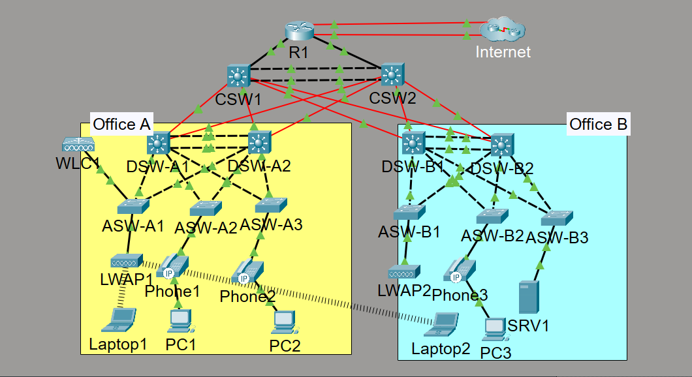

# Enterprise Campus Network – Cisco Packet Tracer

Implementation, verification, security hardening, redundancy testing, and troubleshooting of a multi-site enterprise campus network using Cisco Packet Tracer.

The network contains core, distribution, and access layers across two office locations, centralized routing and network services, redundant gateways, dual Internet connections, IPv6 connectivity, and controller-based wireless networking.

## Network Topology



## Project Overview

This project demonstrates the implementation and operational verification of an enterprise campus network containing:

- Two office locations
- Hierarchical core, distribution, and access layers
- Redundant Layer 2 and Layer 3 paths
- Centralized DHCP and network services
- Dynamic routing with OSPF
- HSRP default-gateway redundancy
- Internet NAT and backup-path failover
- Layer 2 security controls
- IPv4 and IPv6 connectivity
- Wireless LAN Controller and lightweight access points

The completed Packet Tracer activity achieved a score of **96%**.

## Project Origin and Attribution

The original topology and implementation requirements were created by **Jeremy’s IT Lab** as part of the CCNA Mega Lab.

My work included:

- Configuring the routers, multilayer switches, access switches, WLC, access points, and end devices
- Implementing the required routing, switching, security, redundancy, services, IPv6, NAT, and wireless features
- Verifying operation using Cisco IOS show commands and connectivity tests
- Testing gateway and Internet-path failover
- Troubleshooting physical, DHCP, routing, security, and wireless issues
- Organizing device configurations and operational evidence into a professional GitHub repository

I do not claim ownership of the original topology or activity requirements.

## Technologies Implemented

### Switching

- VLANs and access ports
- IEEE 802.1Q trunking
- Native VLAN configuration
- Dynamic Trunking Protocol disabled on manual trunks
- VTP version 2
- Layer 2 EtherChannel
- PAgP and LACP
- Rapid PVST+ on the distribution layer
- Spanning-tree root placement
- PortFast
- BPDU Guard

### Routing and Redundancy

- Inter-VLAN routing
- Routed switch interfaces
- Layer 3 EtherChannel
- OSPF Area 0
- Passive OSPF interfaces
- Point-to-point OSPF network types
- Equal-cost routing
- HSRPv2 default-gateway redundancy
- HSRP and spanning-tree alignment
- Static default routes
- Floating static routes
- Internet-path failover

### Network Services

- Centralized DHCP server
- DHCP relay
- DNS
- NTP
- SNMP
- Syslog
- FTP
- SSH remote management
- LLDP
- CDP disabled according to the activity requirements

### NAT and Access Control

- Static NAT
- Pool-based dynamic PAT
- Standard access control lists
- Extended access control lists
- Source-restricted SSH management
- Primary and backup Internet routes

### Layer 2 Security

- Port Security
- Sticky MAC address learning
- Restrict violation mode
- DHCP Snooping
- DHCP Snooping bindings
- DHCP rate limiting
- Dynamic ARP Inspection
- Trusted infrastructure uplinks
- Untrusted endpoint ports
- Source MAC validation
- Destination MAC validation
- IP address validation

### IPv6

- IPv6 unicast routing
- Global unicast addressing
- EUI-64 interface identifiers
- Link-local addressing
- IPv6 static default routes
- IPv6 floating static routes

### Wireless

- Cisco Wireless LAN Controller
- Lightweight access points
- FlexConnect mode
- Dynamic wireless interface
- WLAN and SSID configuration
- WPA2-PSK authentication
- AES encryption
- Wireless client association
- Centralized AP registration

## Architecture Highlights

### Hierarchical Campus Design

The network uses a three-tier architecture:

```text
Core Layer
    ↓
Distribution Layer
    ↓
Access Layer
    ↓
End Devices
```

The design separates responsibilities between:

- High-speed backbone connectivity at the core
- Routing, gateway redundancy, and spanning-tree control at distribution
- Endpoint, phone, access-point, and WLC connectivity at access

### Redundancy

Redundancy was implemented through:

- Two core multilayer switches
- Two distribution switches per office
- Dual access-switch uplinks
- EtherChannel
- HSRPv2
- Spanning-tree root distribution
- Multiple OSPF paths
- Primary and floating Internet default routes

### Security Boundaries

Endpoint-facing interfaces were treated as untrusted.

Infrastructure uplinks were configured as trusted where required for:

- DHCP Snooping
- Dynamic ARP Inspection
- Trunked VLAN transport

Remote administrative access was limited to SSH and restricted by source network.

## Verification Highlights

### OSPF

R1 formed full OSPF adjacencies with both core switches.

Internal routes were learned through both core switches using equal-cost paths.

See:

- [`verification/ospf.md`](verification/ospf.md)

### HSRP and Spanning Tree

HSRP active roles were distributed between the paired distribution switches.

Spanning-tree root placement was aligned with the active HSRP gateways to reduce unnecessary Layer 2 forwarding paths.

See:

- [`verification/hsrp-and-stp.md`](verification/hsrp-and-stp.md)

### EtherChannel and Switching

Operational Layer 2 and Layer 3 EtherChannels were verified between:

- The core switches
- Office A distribution switches
- Office B distribution switches

PAgP and LACP were both implemented.

See:

- [`verification/switching.md`](verification/switching.md)

### NAT and Internet Failover

PC1 traffic was translated using dynamic PAT.

The primary Internet route used the preferred ISP next hop. After the primary connection was disabled, the floating static route became active through the backup ISP.

The preferred route returned after the primary connection was restored.

See:

- [`verification/nat-and-failover.md`](verification/nat-and-failover.md)

### DHCP and Layer 2 Security

Operational evidence confirmed:

- Centralized DHCP address allocation
- DHCP Snooping
- A valid DHCP Snooping binding
- Dynamic ARP Inspection
- Port Security
- Sticky MAC learning
- Trusted uplinks
- Untrusted endpoint ports
- SSH-only management access
- VTY source restrictions

See:

- [`verification/security.md`](verification/security.md)

### Wireless

Operational evidence confirmed:

- WLC management reachability
- Enabled WPA2-PSK WLAN
- Two registered lightweight access points
- FlexConnect operation
- Two associated wireless clients
- Internal routed connectivity

The final client captures showed addresses from the management subnet instead of the intended VLAN 40 subnet. This observation is documented transparently and is not represented as a successfully verified VLAN 40 DHCP assignment.

See:

- [`verification/wireless.md`](verification/wireless.md)

## Repository Structure

```text
enterprise-campus-network-packet-tracer/
├── README.md
├── topology/
│   └── enterprise-campus-topology.png
├── configs/
│   ├── R1.txt
│   ├── CSW1.txt
│   ├── CSW2.txt
│   ├── DSW-A1.txt
│   ├── DSW-A2.txt
│   ├── DSW-B1.txt
│   ├── DSW-B2.txt
│   ├── ASW-A1.txt
│   ├── ASW-A2.txt
│   ├── ASW-A3.txt
│   ├── ASW-B1.txt
│   ├── ASW-B2.txt
│   └── ASW-B3.txt
├── documentation/
│   ├── ip-addressing.md
│   ├── network-connections.md
│   ├── vlan-and-switching.md
│   ├── routing-and-redundancy.md
│   ├── network-services.md
│   ├── security-controls.md
│   ├── ipv6.md
│   └── wireless.md
├── verification/
│   ├── ospf.md
│   ├── hsrp-and-stp.md
│   ├── switching.md
│   ├── nat-and-failover.md
│   ├── security.md
│   └── wireless.md
└── troubleshooting/
    └── troubleshooting-log.md
```

## Documentation

Detailed implementation documentation is available here:

- [IP Addressing](documentation/ip-addressing.md)
- [Physical and Logical Connections](documentation/network-connections.md)
- [VLANs and Switching](documentation/vlan-and-switching.md)
- [Routing and Redundancy](documentation/routing-and-redundancy.md)
- [Network Services](documentation/network-services.md)
- [Security Controls](documentation/security-controls.md)
- [IPv6](documentation/ipv6.md)
- [Wireless Networking](documentation/wireless.md)

## Device Configurations

Sanitized configuration records are stored in:

- [`configs/`](configs/)

The configuration directory contains the edge router, core switches, distribution switches, and access switches.

Sensitive credentials are not intentionally published as reusable production credentials.

## Troubleshooting

The project troubleshooting record includes:

- Physical connectivity failure
- Disabled WLAN
- Wireless DHCP and association issues
- Incorrect DAI VLAN selection
- DHCP domain-name correction
- Duplicate IPv6 addressing
- HSRP address conflict
- OSPF simulation behavior
- Extended ACL attachment limitation
- Temporary WLC HTTPS timeout
- Wireless client addressing observation
- NAT and Internet failover testing

See:

- [`troubleshooting/troubleshooting-log.md`](troubleshooting/troubleshooting-log.md)

## Known Limitations and Observations

Cisco Packet Tracer simulates network behavior and does not reproduce every Cisco IOS feature with full production-device fidelity.

The following observations are documented:

- The extended inter-office ACL was defined, but its SVI attachment was not retained consistently by the Packet Tracer switch image.
- Wireless clients were associated and routed successfully, but the final captures showed management-subnet addresses rather than VLAN 40 addresses.
- Some routing and wireless services required additional simulation time before their displayed state updated.
- The Packet Tracer activity file is not included because it contains the original instructor activity content and grading logic.

These limitations are documented rather than hidden or represented as fully successful verification results.

## Skills Demonstrated

This project demonstrates practical experience with:

- Cisco IOS configuration
- Enterprise campus network implementation
- Hierarchical network architecture
- IPv4 and IPv6 addressing
- VLAN and trunk management
- Dynamic routing
- Gateway redundancy
- Spanning-tree design
- EtherChannel
- DHCP and network services
- NAT and Internet failover
- Layer 2 security
- Wireless LAN administration
- Structured troubleshooting
- Operational verification
- Technical documentation
- Git and GitHub repository organization

## Tools Used

- Cisco Packet Tracer
- Cisco IOS command-line interface
- Git
- GitHub
- Markdown

## Final Status

The campus network was implemented, tested, troubleshot, and documented.

Normal operation was verified across routing, switching, redundancy, DHCP, NAT, security, IPv6, and wireless infrastructure, with simulator limitations and unresolved observations recorded explicitly.
